# Sistema de Préstamos de Equipos

Repositorio de práctica en **Python** orientado al curso de **Programación Orientada a Objetos (POO)**. El hilo conductor es un **sistema de préstamos de equipos** (laptops, proyectores, tablets, etc.) que evoluciona desde un enfoque **procedimental** (diccionarios, listas y tuplas) hasta una solución **orientada a objetos** con clases, encapsulación y herencia.

---

## Objetivos de aprendizaje

| Tema | Dónde se practica |
|------|-------------------|
| Clases, objetos, atributos y métodos | `01_ejemplos_material`, `02_taller_clases_objetos` |
| Herencia y `super()` | `01_ejemplos_material`, `reto_herencia.py` |
| Encapsulación y atributos privados | `03_taller_encapsulacion` |
| Estructuras de datos (dict, list, tuple) | `prestamos_equipos.py` |
| Diseño POO integrador | `04_reto_prestamos_equipos` |

---

## Requisitos

- **Python 3.8+** (recomendado 3.10 o superior)
- No se requieren librerías externas; solo se usa la biblioteca estándar (`datetime`)

---

## Estructura del proyecto

```
-sistema_prestamo/
├── 01_ejemplos_material/
│   ├── ejemplo_clases_objetos.py   # Clase Estudiante: atributos y métodos básicos
│   └── ejemplo_herencia.py         # Producto → Alimento / Electrónico
├── 02_taller_clases_objetos/
│   └── taller_clases_objetos.py    # Clase Libro: préstamo y devolución
├── 03_taller_encapsulacion/
│   └── taller_encapsulacion.py       # CuentaBancaria: saldo privado y @property
├── 04_reto_prestamos_equipos/
│   └── sistema_prestamos_poo.py      # Sistema completo en POO (reto integrador)
├── prestamos_equipos.py              # Versión procedimental con menú interactivo
├── reto_herencia.py                   # Reto: jerarquía de productos con stock
├── imagenes/                          # Capturas de pantalla (evidencias)
└── README.md
```

---

## Cómo ejecutar los programas

Desde la raíz del repositorio:

```bash
# Ejemplos del material
python 01_ejemplos_material/ejemplo_clases_objetos.py
python 01_ejemplos_material/ejemplo_herencia.py

# Talleres
python 02_taller_clases_objetos/taller_clases_objetos.py
python 03_taller_encapsulacion/taller_encapsulacion.py

# Reto integrador (POO)
python 04_reto_prestamos_equipos/sistema_prestamos_poo.py

# Programas en la raíz
python prestamos_equipos.py
python reto_herencia.py
```

En Windows también puedes usar `py` en lugar de `python` si lo tienes configurado.

> **Git Bash (MINGW64):** usa siempre `/` en las rutas, no `\`.  
> Correcto: `python 01_ejemplos_material/ejemplo_clases_objetos.py`  
> Incorrecto: `python 01_ejemplos_material\ejemplo_clases_objetos.py` (la `\` une el nombre de carpeta y archivo y Python no encuentra el archivo).

---

## Evidencias (capturas de pantalla)

Las imágenes están en la carpeta [`imagenes/`](imagenes/). Cada actividad incluye captura del **código** y, cuando aplica, de la **consola** al ejecutar el programa.

### 1. Ejemplo: Clases y objetos

**Archivo:** `01_ejemplos_material/ejemplo_clases_objetos.py`

| Código |
|--------|
| 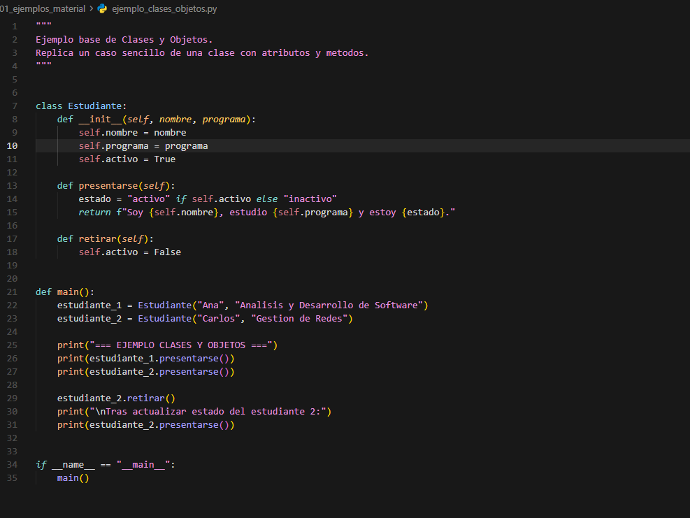 |

```bash
python 01_ejemplos_material/ejemplo_clases_objetos.py
```

---

### 2. Ejemplo: Herencia

**Archivo:** `01_ejemplos_material/ejemplo_herencia.py`

| Código | Consola |
|--------|---------|
| 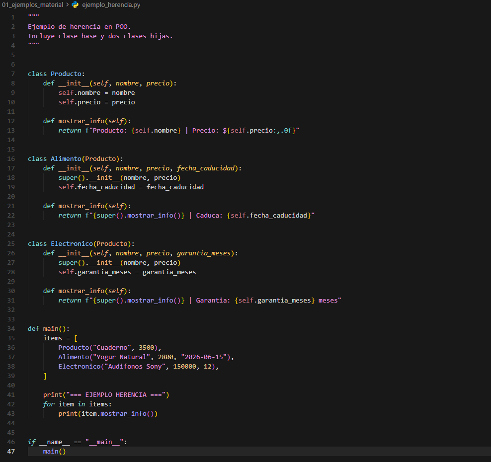 | 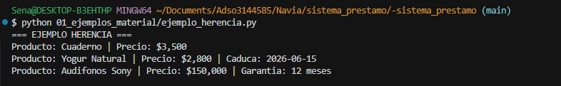 |

```bash
python 01_ejemplos_material/ejemplo_herencia.py
```

---

### 3. Taller: Clases y objetos

**Archivo:** `02_taller_clases_objetos/taller_clases_objetos.py`

| Código | Consola |
|--------|---------|
| 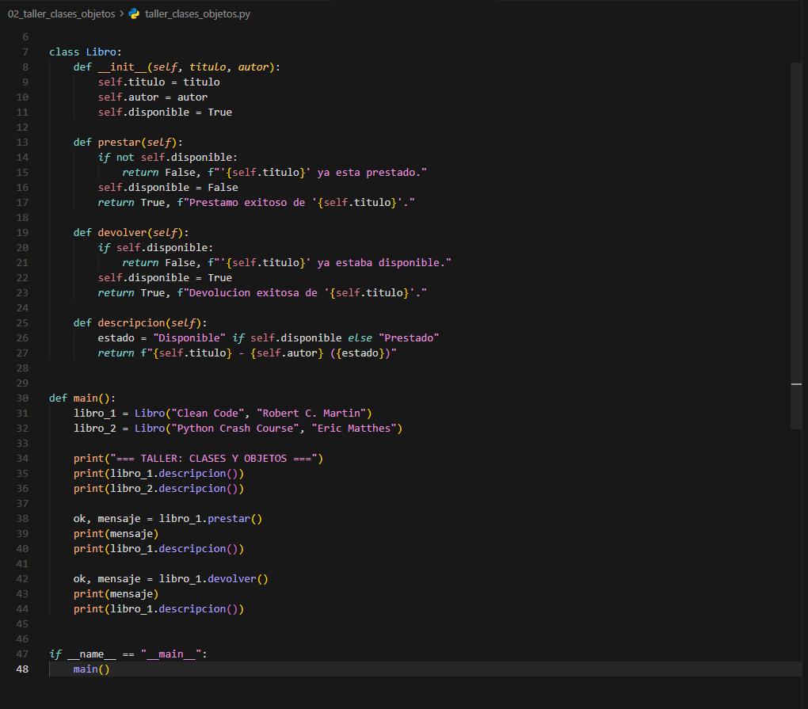 | 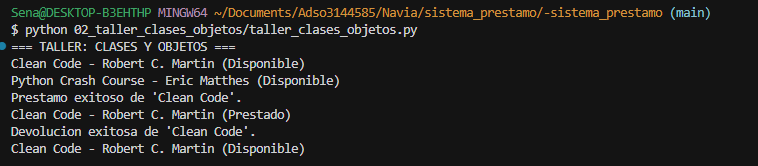 |

```bash
python 02_taller_clases_objetos/taller_clases_objetos.py
```

---

### 4. Taller: Encapsulación

**Archivo:** `03_taller_encapsulacion/taller_encapsulacion.py`

| Código | Consola |
|--------|---------|
| 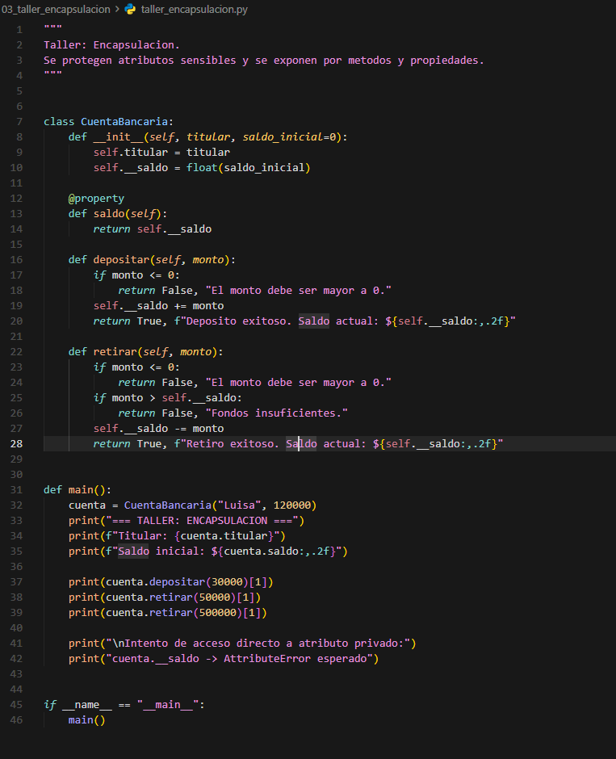 | 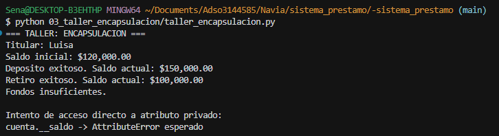 |

```bash
python 03_taller_encapsulacion/taller_encapsulacion.py
```

---

### 5. Sistema procedimental (diccionarios, listas, tuplas)

**Archivo:** `prestamos_equipos.py`

| Código | Consola (menú e inventario) |
|--------|------------------------------|
| 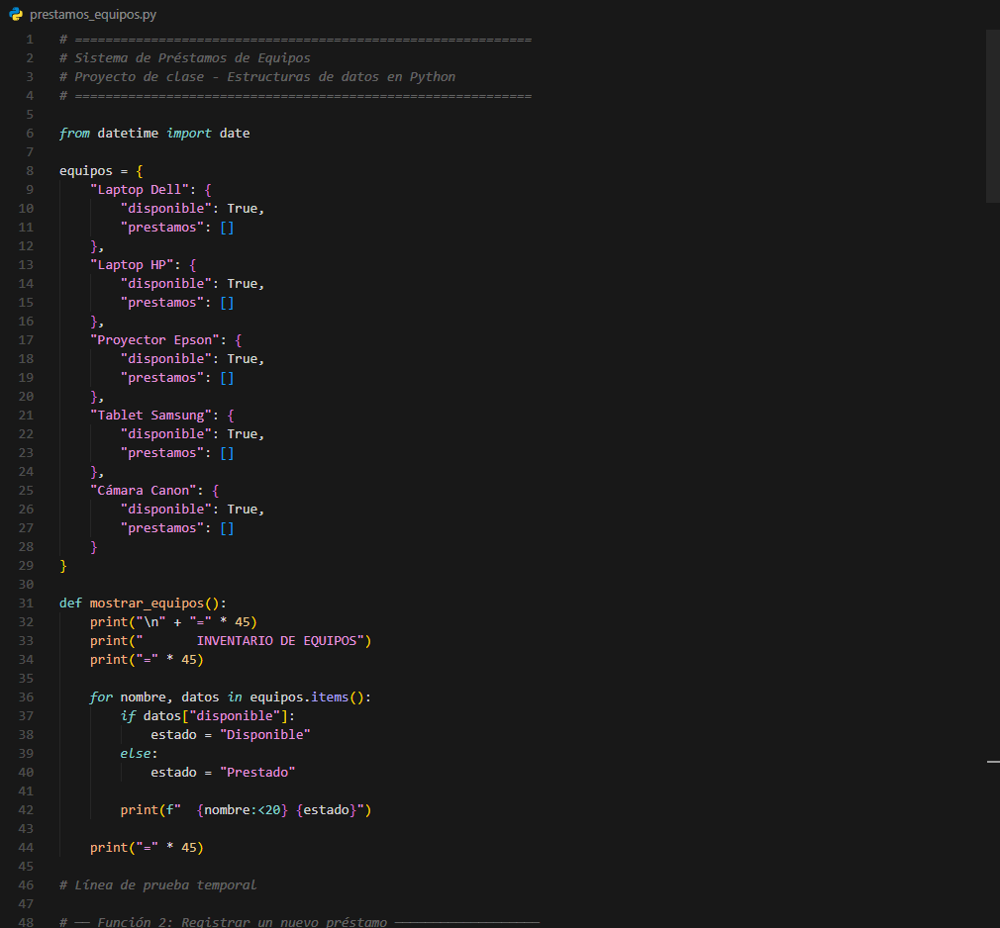 | 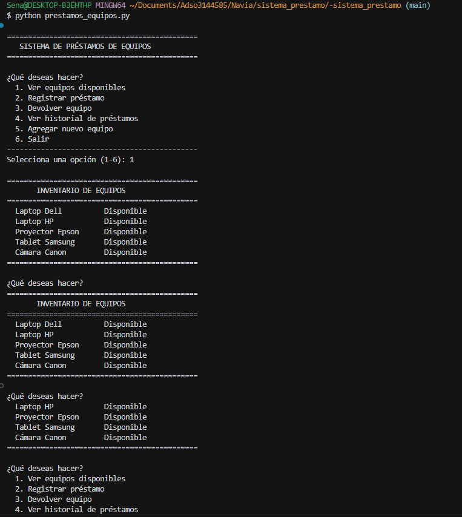 |

```bash
python prestamos_equipos.py
```

---

### 6. Reto integrador POO

**Archivo:** `04_reto_prestamos_equipos/sistema_prestamos_poo.py`

| Código | Consola (registro de equipo) |
|--------|------------------------------|
| 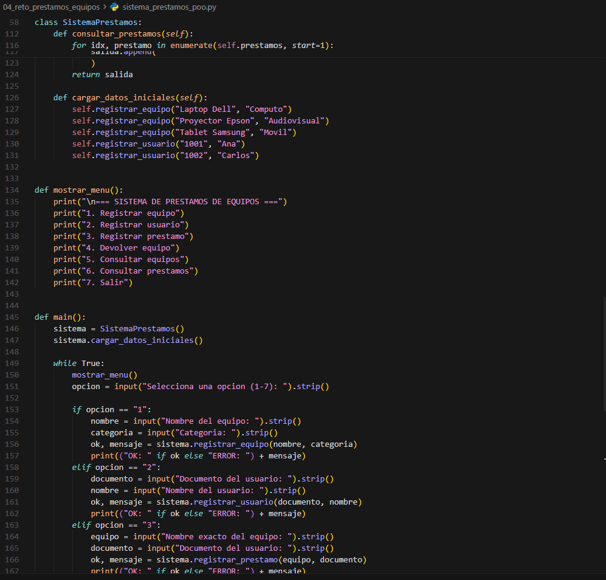 | 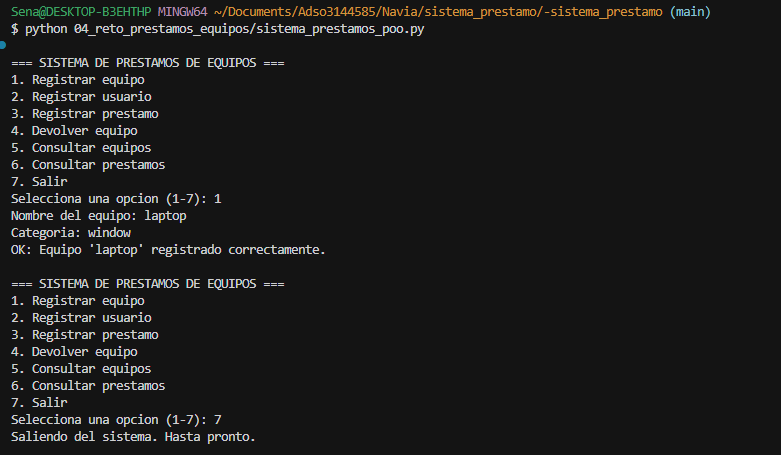 |

```bash
python 04_reto_prestamos_equipos/sistema_prestamos_poo.py
```

---

### 7. Reto de herencia (jerarquía de productos)

**Archivo:** `reto_herencia.py`

| Código |
|--------|
| 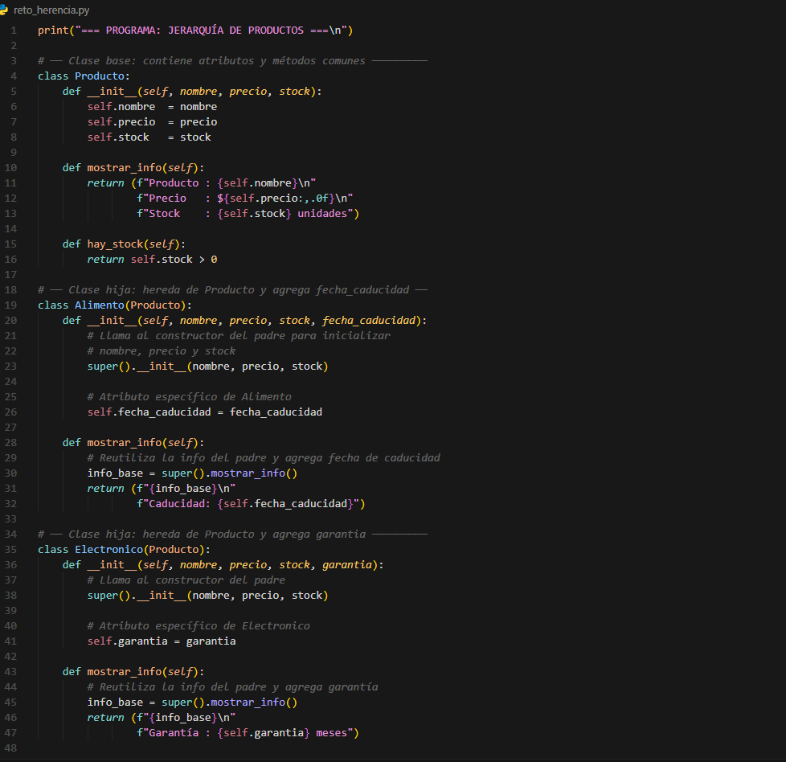 |

```bash
python reto_herencia.py
```

---

## Descripción por módulo

### 1. Ejemplos del material (`01_ejemplos_material`)

- **`ejemplo_clases_objetos.py`**: Define la clase `Estudiante` con `presentarse()` y `retirar()`. Muestra cómo crear instancias y cambiar su estado.
- **`ejemplo_herencia.py`**: Clase base `Producto` y subclases `Alimento` y `Electronico` que extienden `mostrar_info()` con `super()`.

### 2. Taller: Clases y objetos (`02_taller_clases_objetos`)

- **`taller_clases_objetos.py`**: Modela un `Libro` con préstamo/devolución y estado disponible/prestado. Caso práctico cercano al dominio del préstamo de equipos.

### 3. Taller: Encapsulación (`03_taller_encapsulacion`)

- **`taller_encapsulacion.py`**: Clase `CuentaBancaria` con saldo privado (`__saldo`), acceso controlado mediante `@property` y métodos `depositar()` / `retirar()`.

### 4. Reto integrador POO (`04_reto_prestamos_equipos`)

- **`sistema_prestamos_poo.py`**: Implementación completa del sistema de préstamos.

| Clase | Responsabilidad |
|-------|-----------------|
| `Equipo` | Nombre, categoría y disponibilidad (`marcar_prestado`, `marcar_devuelto`) |
| `Usuario` | Documento y nombre |
| `Prestamo` | Relación equipo–usuario, fechas y estado (ACTIVO / DEVUELTO) |
| `SistemaPrestamos` | Registro de equipos, usuarios y préstamos; menú interactivo |

**Menú del reto POO:**

1. Registrar equipo  
2. Registrar usuario  
3. Registrar préstamo  
4. Devolver equipo  
5. Consultar equipos  
6. Consultar préstamos  
7. Salir  

Al iniciar, el sistema carga datos de ejemplo (equipos y usuarios).

### 5. Sistema procedimental (`prestamos_equipos.py`)

Versión **sin clases**: un diccionario `equipos` donde cada equipo tiene:

- `disponible`: booleano  
- `prestamos`: lista de tuplas `(usuario, fecha)`  

**Funciones principales:** `mostrar_equipos`, `registrar_prestamo`, `devolver_equipo`, `ver_historial`, `agregar_equipo`, `menu`.

**Menú:**

1. Ver equipos disponibles  
2. Registrar préstamo  
3. Devolver equipo  
4. Ver historial de préstamos  
5. Agregar nuevo equipo  
6. Salir  

Equipos iniciales: Laptop Dell, Laptop HP, Proyector Epson, Tablet Samsung, Cámara Canon.

### 6. Reto de herencia (`reto_herencia.py`)

Jerarquía de productos de inventario:

- **`Producto`**: nombre, precio, stock; métodos `mostrar_info()` y `hay_stock()`  
- **`Alimento`**: agrega `fecha_caducidad`  
- **`Electronico`**: agrega `garantia` (meses)  

Demuestra herencia, `super().__init__()` y sobrescritura de métodos en un flujo de demostración (sin menú).

---

## Evolución del proyecto

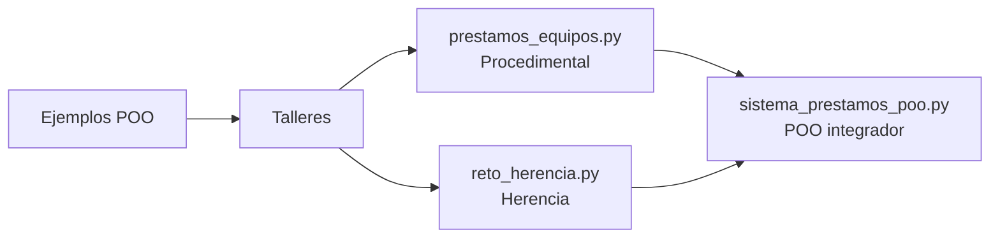

1. **Conceptos base** → clases, herencia, encapsulación en ejercicios pequeños.  
2. **Versión procedimental** → mismas ideas de negocio con dict/list/tuple.  
3. **Reto POO** → refactor a clases con responsabilidades claras y validaciones.

---

## Conceptos clave aplicados

- **Herencia**: reutilizar atributos y métodos del padre (`Producto`, `Equipo` como modelo conceptual).  
- **Encapsulación**: atributos privados (`_disponible`, `__saldo`) y acceso mediante propiedades o métodos.  
- **Colecciones**: diccionarios para inventario y usuarios; listas para historial de préstamos; tuplas inmutables para registros `(usuario, fecha)` en la versión procedimental.  
- **Validación**: comprobar existencia del equipo, disponibilidad y usuarios registrados antes de operar.

---

## Notas

- Los nombres de equipos deben coincidir **exactamente** con los registrados al prestar o devolver (sensible a mayúsculas y espacios).  
- Las fechas se guardan como texto con `date.today()` (`YYYY-MM-DD`).  
- Este repositorio es material educativo; no persiste datos en archivo ni base de datos: al cerrar el programa, la información en memoria se pierde.

---

## Autor / contexto

Proyecto desarrollado en el marco de formación **ADSO** (Análisis y Desarrollo de Software), módulo de Python y POO — SENA.
